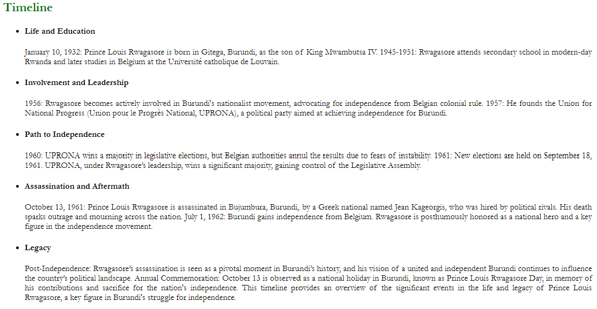
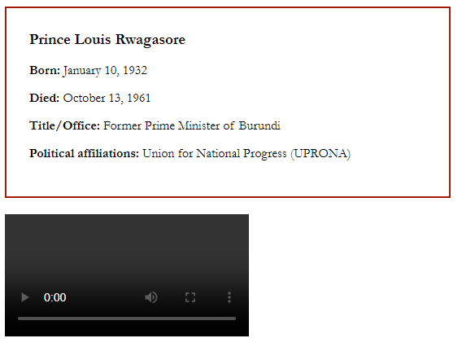
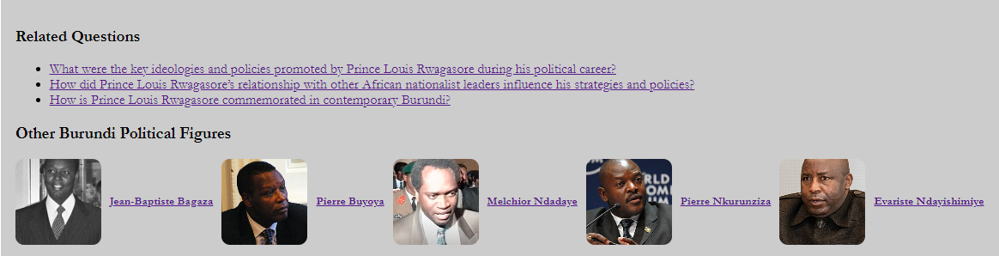

# Prince Louis Rwagasore Legacy Website

Welcome to the Prince Louis Rwagasore Legacy Website. This website is dedicated to sharing and preserving the historical legacy of Prince Louis Rwagasore, a significant figure in the history of Burundi.

## Purpose

The purpose of this web application is to provide a centralized repository of historical facts, anecdotes, and educational content about Prince Louis Rwagasore. Our goal is to educate users about his contributions, leadership, and impact on the history of Burundi.

## Value Proposition

By using this web application, users can:
- Access a wealth of curated historical facts and stories about Prince Louis Rwagasore.
- Learn about the historical context and significance of his actions and leadership.
- Engage with multimedia content, including articles, videos, and images.
- Learn about other Burundi political figures and landscape in general.

## Features

- **Curated Content**: High-quality, well-researched historical facts and stories.
- **Multimedia Integration**: Videos, images, and articles to enhance learning.

## Deployment Procedure
Doownlaod an install Heroku CLI
    Run command: npm install -g heroku
    Verify installation: heroku --version

### Prerequisites
The Heroku CLI requires Git, the popular version control system. If you don’t have Git installed, complete:

Git installation
First-time Git setup

### Steps

1.Clone the Repository
